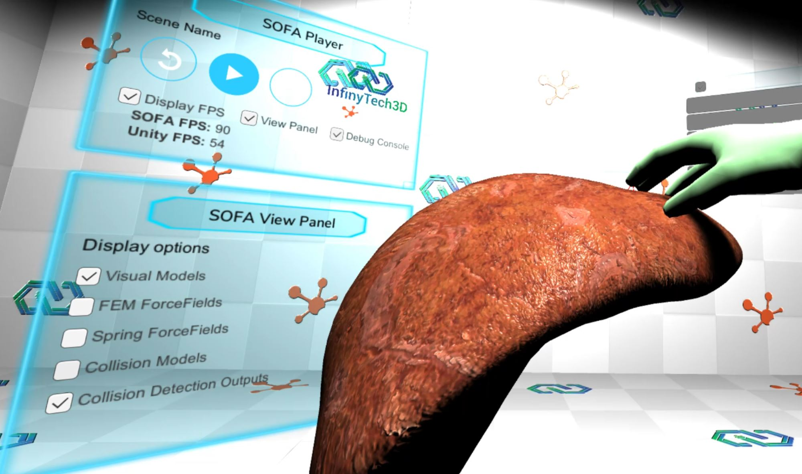
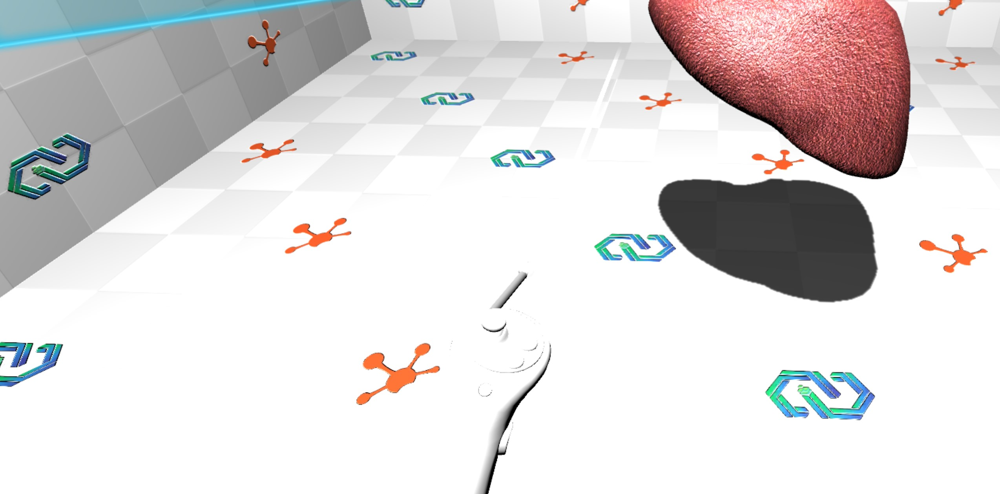
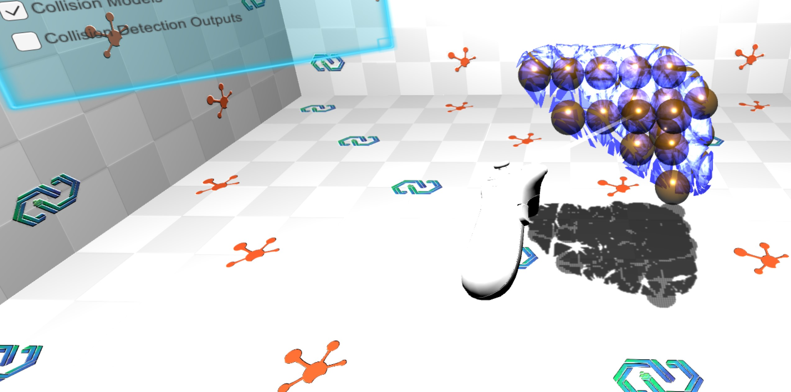

# SofaUnityXR Asset

## Description
SofaUnityXR extends the [SofaUnity](https://github.com/InfinyTech3D/SofaUnity) asset by adding script for VR and XR device support to interact with SOFA simulations embedded in Unity3D.
It allows users to interact with SOFA's advanced physical simulation capabilities in real-time through VR controllers and headsets using Unity’s XR system, enabling immersive medical, robotic, or scientific training applications.

This package need [SofaUnity](https://github.com/InfinyTech3D/SofaUnity) Asset to work. It only provide the bridge to use SOFA in VR through Unity. No complexe surgical or robotic scenario are provided.

	

### Compatibility:
* Tested on Unity version > 2022.3.x (Tested with LTS 2022.3 and 2023.3)
* SOFA version > 24.06 with SofaVerseAPI
* Tested on Windows platforms only

### Installation guide
Full installation process available [here](https://infinytech3d.com/getting-started/).

## Dependencies
+ Requires SofaUnity asset installed.
+ XR Interaction Toolkit (tested with v4.4.0)
    + Starter Asset
+ OpenXR Plugin (tested with v1.10.0)
+ Input System (tested with v1.7.0)

## Examples
Two examples are provided in the Scenes folder
- Demo-01_SimpleLiver.unity: Provides a simple integration of SOFA deformable liver simulation in VR, allowing to play/restart simulation and show different models.
- Demo-02_LiverInteraction.unity: Demonstrate how to interact between VR controllers (with SOFA sphere collisions) and deformable liver.

Here are a some results of the basic integration:
|||
|--|--|--|
| Simple Liver simulation | FEM and sphere collision display |

## License
This main Unity asset is under Standard Unity Asset Store EULA
Other license formats can be provided for commercial use. For more information check [InfinyTech3D license page](https://infinytech3d.com/licenses/).