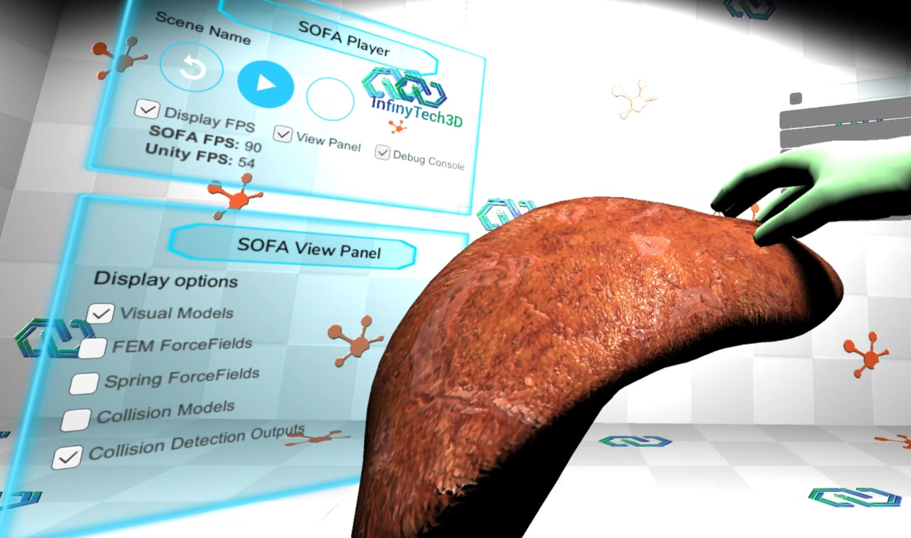
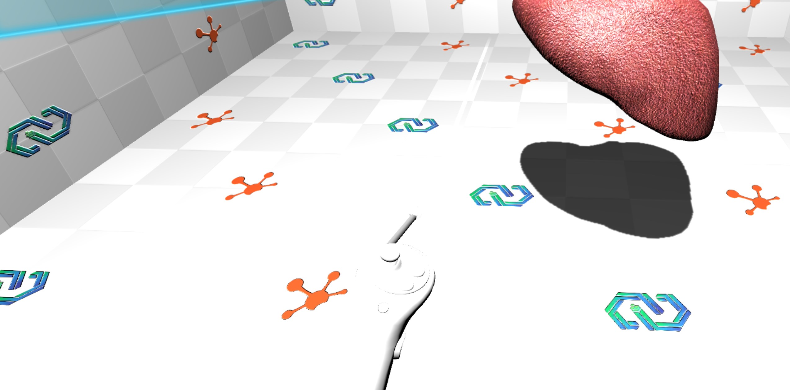
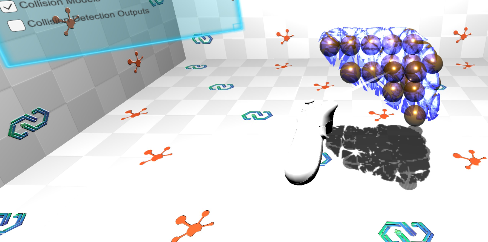

# SofaUnityXR Asset

## Description
SofaUnityXR extends the [SofaUnity](https://github.com/InfinyTech3D/SofaUnity) asset by adding script for VR and XR device support to interact with SOFA simulations embedded in Unity3D.
It allows users to interact with SOFA's advanced physical simulation capabilities in real-time through VR controllers and headsets using Unity’s XR system, enabling immersive medical, robotic, or scientific training applications.

This package need [SofaUnity](https://github.com/InfinyTech3D/SofaUnity) Asset to work. It only provide the bridge to use SOFA in VR through Unity. No complexe surgical or robotic scenario are provided.

	

### Compatibility:
* Tested on Unity version > 6000.0.55f1 
* SOFA version v25.12 with SofaVerseAPI: https://github.com/InfinyTech3D/SofaUnity/releases/tag/SofaUnity_v25.12.00-URP
* Tested on Windows platforms only
* Most of our work is tested on Meta headsets; we can't guarantee that all functionalities will work on other headsets.

### Installation guide
Sofaunity Full installation process available [here](https://infinytech3d.com/getting-started/).

## Dependencies: Required Unity Packages
+ Requires SofaUnity asset installed.

Before starting the project in Unity, open the **Package Manager** and import/update the following packages:  
| Package                   | Version | Link |
|----------------------------|---------|------|
| XR Interaction Toolkit     | 3.0.8   | Also import **Samples Starter Assets**   |
| OpenXR                     | 1.15.1  | Go to **Project Settings > XR Plug-in Management** and check the **OpenXR** checkbox under Plugin Providers   |
| TextMeshPro                | Latest  | Built-in (Unity Package Manager) |

### OpenXR setup: 
Go to "Project setting" Windows then in XR Plug-in Management>Plugin providers select "OpenXR"
We also recommend you tu specify the type of controller you're using inside the XR Plug-in Managment > OpenXR Windows by clicking "+" in Enabled Interaction Profiles.
For more details you can check "OpenXR setup" in https://developers.meta.com/horizon/documentation/unity/unity-project-setup/ 

## Examples
Three examples are provided in the Scenes folder
- Demo-01_SimpleLiver.unity: Provides a simple integration of SOFA deformable liver simulation in VR, allowing to play/restart simulation and show different models.
- Demo-02_LiverInteraction.unity: Demonstrate how to interact between VR controllers (with SOFA sphere collisions) and deformable liver. Show how you can import a sofa scene and how the "panel" list and transform your sofa object into intractable objects. To start the simulation, check the simulation mode box.
- Demo-03_Caduceus Show how you can manage multiple objects of your sofa scene by selecting them then you can start the simulation with the check box 
- Demo-04_Caduceus_SlicingPlane add functionalities around a sphere that can slice through your sofa object useful to see inside

Here are a some results of the basic integration:
|||
|--|--|
| Simple Liver simulation | FEM and sphere collision display |

## License
This main Unity asset is under Standard Unity Asset Store EULA
Other license formats can be provided for commercial use. For more information check [InfinyTech3D license page](https://infinytech3d.com/licenses/).
